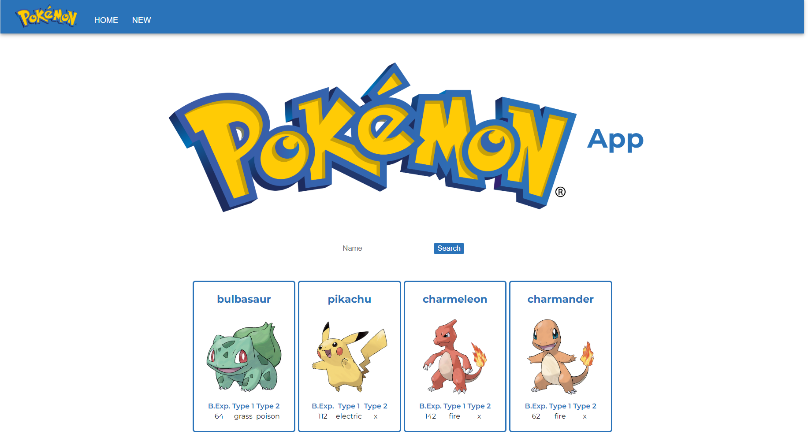
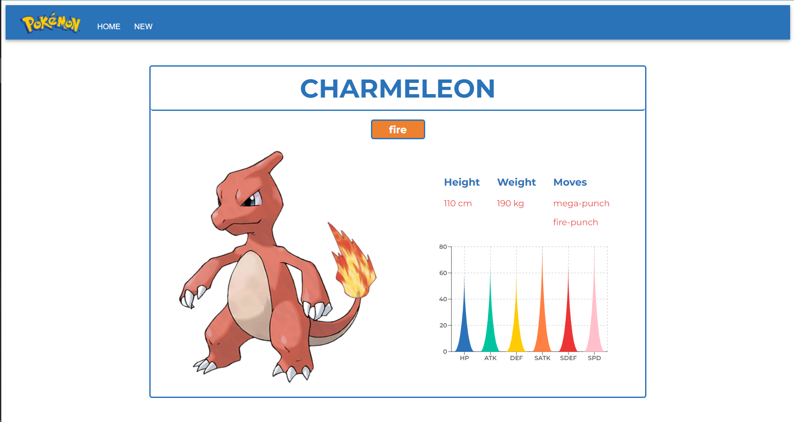
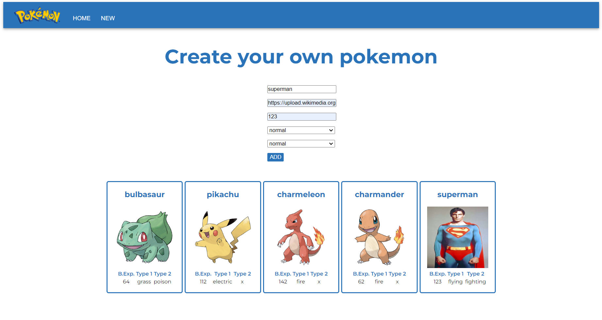

# PokeApp

This is a web where you can search pokemon's and see their characteristics.

## Table of contents

- [Guide](#guide)
  - [Prerequisites](#prerequisites)
  - [Installation](#installation)
  - [Usage](#usage)
- [Overview](#overview)
  - [The challenge](#the-challenge)
  - [Screenshot](#screenshot)
  - [Links](#links)
- [My process](#my-process)
  - [Built with](#built-with)
  - [What I learned](#what-i-learned)
  - [Continued development](#continued-development)
  - [Useful resources](#useful-resources)
- [Author](#author)
- [Acknowledgments](#acknowledgments)

## Guide

### Prerequisites

You need to install npm. To install the latest version:

- npm
  ```sh
  npm install npm@latest -g
  ```

### Installation

1. Clone the repo
   ```sh
   git clone https://github.com/Radu-A/pokeapp
   ```
2. Install NPM packages
   ```sh
   npm install
   ```
3. Run the app
   ```js
   npm start
   ```

### Usage

- Home: Introduce the name of the pokemon and press "search". If you click on the name of the pokemon you will go to his details view.
- New: Fill all the fields and press "Add".

## Overview

### The challenge

Phase 1
- Create these components: Search, List, Card
- Sibling comunication between Search and List
- HTTP request to https://pokeapi.co/
- Reset the value of the input after the search
Phase 2
- Debounce: After 3 seconds from the last typing, the search will be carried out
- Routing with react-router-dom:
  "/" Home
  "/new" New
  "/pokemon?name=name" Details
- "New": a form to create a new pokemon
- "Details": a page with more specific data of one pokemon

### Screenshot





### Links

- Solution URL: (https://github.com/Radu-A/pokeapp)
- Live Site URL: (https://incomparable-macaron-afd876.netlify.app/)

## My process

### Built with

- Semantic HTML5 markup
- SASS custom properties
- Flexbox
- Mobile-first workflow
- [React](https://reactjs.org/) - JS library
- [Material UI](https://mui.com/) - For styles

### What I learned

- useState and useEffect: I got used to work with the state of a variable and how you can use it to render components.
- SASS: not only how to use it but also how to install it and create directories and files.
- How HTTP request works on React. Mainly, deal with asynchrony when you are rendering data from a request to an API.
- How to use useContext. 
- Introduce and validate data with "react-hook-form".
- Use keywords from url with "react-router-dom".

### Continued development

- Implement Firebase to save favorites
- Implement Firebase Auth

### Useful resources

- [React documentation](https://es.react.dev/learn) - This is an amazing documentation that guides you to get used with the way that React works.
- [react-hook-form documentation](https://react-hook-form.com/get-started) - This documentation is also great and show you step by step how to implement this hook to your project.

## Acknowledgments

Thanks a million to my teacher Alejandro Reyes and his teacher assistances Guillermo Rubio and Javier Espinosa. I can do all this stuff because of them.
